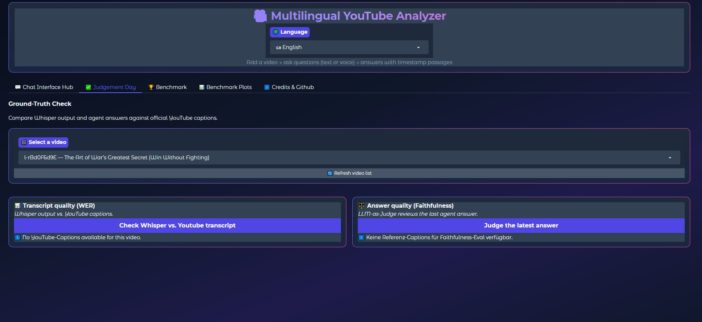
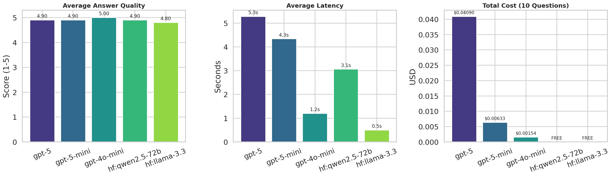

# Multilingual YouTube Analyzer

**Final Project — Ironhack AI Engineering Bootcamp**

A production-grade, data-driven Retrieval-Augmented Generation (RAG) system for multilingual question answering over YouTube video content. Built in Python with LangChain, OpenAI Whisper, ChromaDB, and Gradio. Runs in Google Colab and locally.

[](https://colab.research.google.com/github/DanielHuette/Multilingual_YouTube_Analyzer/blob/main/Multilingual_YouTube_Analyzer.ipynb)
[](https://colab.research.google.com/github/DanielHuette/Multilingual_YouTube_Analyzer/blob/main/benchmark.ipynb)

---

## What this project does

Drop a YouTube URL into the Gradio UI, and the system

1. Downloads the audio,
2. Transcribes it with OpenAI Whisper (API or local),
3. Chunks the transcript and stores embeddings in a local ChromaDB vector store,
4. Answers natural-language questions about the video content via a LangChain agent (text or voice input),
5. Returns answers with timestamp deep-links into the original video and live cost tracking.

Every architectural choice — Whisper model size, audio bitrate, embedding model, LLM, chunk size, RAG vs. no-RAG — is backed by the seven systematic benchmarks in `benchmark.ipynb`.

---

## Quick Start (3 steps)

### 1. Open in Colab (recommended for first run)

Click the Colab badge above for the **Q&A notebook** and follow the instructions in the first cells. The notebook will:

- Install dependencies
- Auto-download the benchmark imports folder from this repo
- Set up ChromaDB locally in the Colab session
- Launch the Gradio UI

You will need an **OpenAI API key** (and optionally a HuggingFace token and a LangSmith API key for tracing). The notebook prompts you for them.

### 2. Run locally

```bash
git clone https://github.com/DanielHuette/Multilingual_YouTube_Analyzer.git
cd Multilingual_YouTube_Analyzer
python -m venv .venv && source .venv/bin/activate    # Windows: .venv\Scripts\activate
pip install -r requirements.txt
```

Create a `.env` file in the project root:

```
OPENAI_API_KEY=sk-...
HF_TOKEN=hf_...                 # optional, only needed for open-source LLMs
LANGSMITH_API_KEY=lsv2_...      # optional, only needed for LangSmith tracing
```

Then open `Multilingual_YouTube_Analyzer.ipynb` in Jupyter and run all cells. The notebook auto-detects local mode and uses the project folder for ChromaDB and audio cache.

### 3. (Optional) Re-run the benchmarks

If you want to regenerate the benchmark plots and CSVs (the contents of `benchmark_imports_for_QandA_notebook/`), open `benchmark.ipynb` and run it end to end. Outputs are written into the same folder and are picked up by the Q&A notebook on the next run.

---

## Repository layout

```
Multilingual_YouTube_Analyzer/
├── Multilingual_YouTube_Analyzer_Presentation.pptx   ← pitch deck
├── Multilingual_YouTube_Analyzer.ipynb               ← main Q&A notebook (Gradio UI)
├── benchmark.ipynb                                   ← seven systematic benchmarks
├── benchmark_imports_for_QandA_notebook/             ← all PNGs, JSONs, CSVs
│   ├── benchmark1.png                                  consumed by the Q&A UI
│   ├── benchmark2.png
│   ├── ...
│   ├── prices.json
│   ├── combo_table.csv
│   └── ...
├── ARCHITECTURE.md                                   ← detailed system design
├── TECHNICAL_REPORT.md                               ← benchmark methodology + results
├── README.md                                         ← this file
├── LICENSE
└── requirements.txt
```

---

## How a recruiter or first-time visitor should read this repo

1. **Watch the pitch:** open `Multilingual_YouTube_Analyzer_Presentation.pptx`. ~10 minutes.
2. **Try it live:** click the "Open Q&A Notebook in Colab" badge above. ~5 minutes to first answer.
3. **Read the methodology:** `TECHNICAL_REPORT.md` summarizes the seven benchmarks and their findings.
4. **Inspect the architecture:** `ARCHITECTURE.md` walks through the pipeline component by component.
5. **Look at the code:** start with `Multilingual_YouTube_Analyzer.ipynb`. The notebook is sectioned (1–17) and each section is small enough to read in one sitting.

---

## System architecture (overview)

```
YouTube URL
     │
     ▼
yt-dlp        (audio download, 64 kbps m4a)
     │
     ▼
Whisper       (OpenAI API or local: tiny/base/small/medium/large-v3)
     │   ↳ adaptive chunk size based on video duration (chunk_recommendations.json)
     ▼
tiktoken      → text-embedding-3-small → ChromaDB
     │
     ▼
LangChain ReAct Agent  (LangGraph + MemorySaver)
     │   ↳ 7 tools: search_video_content, list_indexed_videos, add_new_video,
     │     get_video_metadata_tool, summarize_video, compare_videos, extract_key_moments
     ▼
Gradio UI     (10 UI languages, voice input, timestamp deep-links, cost tracking)
     │
     ▼
LangSmith     (latency & cost tracing, EU endpoint)
```

For a detailed walk-through, see [`ARCHITECTURE.md`](ARCHITECTURE.md).

---

## Features

- **Audio-based ingestion** — yt-dlp downloads audio at 64 kbps; Whisper transcribes with configurable backend.
- **Switchable Whisper backends** — OpenAI API (`whisper-1`) or open-source local (`tiny` … `large-v3`).
- **Adaptive chunking** — chunk size selected per video duration and Whisper model from empirically derived `chunk_recommendations.json`.
- **7 LangChain agent tools** — `search_video_content`, `list_indexed_videos`, `add_new_video`, `get_video_metadata_tool`, `summarize_video`, `compare_videos`, `extract_key_moments`.
- **Model-agnostic agent** — switch at runtime: `gpt-4o-mini`, `gpt-5-mini`, `gpt-5`, `gpt-4o`, `hf:llama-3.3`, `hf:qwen2.5-72b`.
- **Conversational memory** — per-session thread memory via LangGraph `MemorySaver`.
- **Voice input** — record a question via the browser microphone; Whisper transcribes it and the agent answers.
- **Timestamp deep-links** — retrieved passages link directly to the relevant moment on YouTube.
- **10 UI languages** — English, German, Spanish, French, Turkish, Chinese, Hindi, Italian, Portuguese, Arabic.
- **Live cost tracking** — per-request and per-session cost estimates, real numbers from token usage.
- **Ground-truth evaluation** — WER (Word Error Rate) comparison between Whisper output and YouTube captions, plus LLM-as-Judge faithfulness scoring.
- **LangSmith tracing** — EU endpoint, latency and cost analytics.
- **Persistent storage** — optional Google Drive mounting for ChromaDB persistence in Colab.

---

## Benchmark-driven design

Every architectural choice is grounded in seven systematic benchmarks. See [`TECHNICAL_REPORT.md`](TECHNICAL_REPORT.md) for the full methodology and results.

| Benchmark | Variable | Key finding |
|---|---|---|
| **B1 — Whisper Model Sizes** | 6 models × 3 videos | `whisper-small`: WER 2.40 % at $0.0097/run — best cost/quality ratio |
| **B2 — Audio Bitrate** | 8–128 kbps | 64 kbps = sweet spot; near-identical WER to 128 kbps at half the file size |
| **B3 — Embedding Models** | 3 models (OpenAI + HuggingFace) | `text-embedding-3-small` matches `large` at a fraction of the cost |
| **B4 — LLM Comparison** | 5 models, 10 eval questions | `gpt-4o-mini`: score 5.0, latency 1.2 s, $0.00154 — best quality/cost ratio |
| **B5 — RAG vs. No-RAG** | With/without retrieval | RAG lifts accuracy from 20–70 % to ~100 % |
| **B6 — Chunk-Size Grid** | 3 videos × 6 Whisper × N configs | Optimal chunk size scales with video length — no single best config |
| **B7 — Full Whisper × LLM Matrix** | 6 × 5 = 30 combinations | Data basis for model dropdown and sweet-spot recommendations in the UI |

### Sweet-spot recommendations (B7 output)

| Tier | Whisper | LLM | Est. Cost / Query |
|---|---|---|---|
| Solo Developer | `local: small` | `hf:llama-3.3` | ≈ $0.00 |
| Start-up | `local: small` | `gpt-4o-mini` or Llama | ≈ $0.001 |
| Mid-size Company | `api (whisper-1)` | `gpt-5-mini` | ≈ $0.01–0.05 |
| Enterprise | `api (whisper-1)` | `gpt-5-mini` or higher | ≈ $0.05+ |

---

## Screenshots

### Chat Interface — main application view


The main UI showing a question answered with retrieved passages, timestamps, live cost tracking, and top-3 passage ranking.

### Benchmark Results — Sweet-Spot Recommendations


Configuration recommendations for different user profiles based on systematic Whisper × LLM benchmarking.

### Ground-Truth Evaluation



WER (Word Error Rate) and LLM-as-Judge faithfulness evaluation against official YouTube captions.

### RAG vs. No-RAG (Benchmark 5)


Empirical demonstration that retrieval-augmented generation lifts answer accuracy substantially over no-RAG baselines.

### LLM Comparison (Benchmark 4)



Side-by-side comparison of GPT-5, GPT-5-mini, GPT-4o-mini, Qwen-2.5-72B, and Llama-3.3 across answer quality, latency, and cost.

---

## API keys you may need

| Key | Required for | Where to get |
|---|---|---|
| `OPENAI_API_KEY` | yes | https://platform.openai.com/api-keys |
| `HF_TOKEN` | optional | https://huggingface.co/settings/tokens — only needed if you select an `hf:*` model |
| `LANGSMITH_API_KEY` | optional | https://smith.langchain.com — only needed for tracing |

In Colab, set them via the "🔑" secrets sidebar. Locally, use a `.env` file in the project root.

---

## Tech stack

- **Python 3.10+**
- **LangChain** — agent framework, tools, memory
- **LangGraph** — ReAct agent factory with checkpointing
- **OpenAI Whisper** — speech-to-text (API + local)
- **OpenAI GPT-4o-mini, GPT-5, GPT-5-mini, GPT-4o** — agent LLMs
- **Llama 3.3 70B, Qwen 2.5 72B** (via Hugging Face Inference API) — open-source LLM options
- **ChromaDB** — vector database
- **OpenAI text-embedding-3-small** — default embedding model
- **tiktoken** — chunker
- **yt-dlp** — audio download
- **Gradio** — web UI
- **LangSmith** — tracing (EU endpoint)

---

## License

See [`LICENSE`](LICENSE).

---

## Contact

Daniel Hütte — [LinkedIn](https://www.linkedin.com/in/daniel-h%C3%BCtte-183a073aa/) — [GitHub](https://github.com/DanielHuette)
